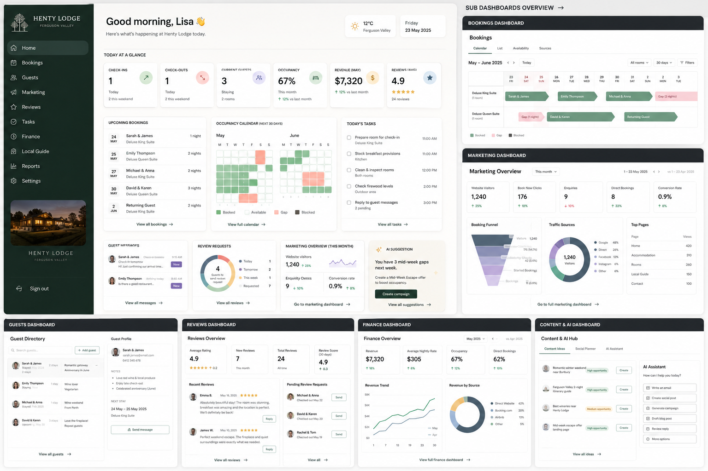

# Henty Lodge Command Centre

A small accommodation dashboard for **Henty Lodge** that combines bookings, guests, tasks, reviews, finance, marketing and AI suggestions into one daily operating view.

The MVP starts with manual/sample data and grows into integrations with Cloudbeds, Google Analytics, Google Search Console, Google Business Profile and Google Ads.



---

## Product goal

Every morning, the dashboard should answer:

> What is happening at Henty Lodge today, what needs attention, and what should I do next?

---

## MVP pages

1. **Dashboard** — daily command centre
2. **Bookings** — calendar/list view
3. **Guests** — guest directory and guest notes
4. **Tasks** — cleaning, maintenance, admin and marketing tasks
5. **Reviews** — review score, recent reviews and pending review requests
6. **Finance** — simple revenue, occupancy and source mix
7. **Marketing & AI** — website metrics, campaign ideas and AI-generated drafts

---

## Recommended stack

- Next.js App Router
- TypeScript
- Tailwind CSS
- shadcn/ui
- Supabase
- Recharts
- OpenAI API
- Vercel

---

## Project documents

- [`AGENTS.md`](AGENTS.md) — instructions for AI coding agents
- [`docs/PROJECT_OVERVIEW.md`](docs/PROJECT_OVERVIEW.md) — product overview
- [`docs/MVP_SCOPE.md`](docs/MVP_SCOPE.md) — MVP boundaries
- [`docs/FEATURES.md`](docs/FEATURES.md) — feature list
- [`docs/DATA_MODEL.md`](docs/DATA_MODEL.md) — database structure
- [`docs/INTEGRATIONS.md`](docs/INTEGRATIONS.md) — integration plan
- [`docs/AI_WORKFLOWS.md`](docs/AI_WORKFLOWS.md) — AI features and workflows
- [`docs/DESIGN_SYSTEM.md`](docs/DESIGN_SYSTEM.md) — UI direction
- [`docs/UI_MOCKUPS.md`](docs/UI_MOCKUPS.md) — included mockups
- [`docs/ROADMAP.md`](docs/ROADMAP.md) — staged build plan
- [`docs/DEVELOPMENT_TASKS.md`](docs/DEVELOPMENT_TASKS.md) — implementation checklist
- [`docs/SECURITY_AND_APPROVALS.md`](docs/SECURITY_AND_APPROVALS.md) — safety rules
- [`docs/PROMPTS.md`](docs/PROMPTS.md) — AI prompts

---

## Build order

1. Layout and sidebar
2. Seed data
3. Main dashboard
4. Bookings page
5. Guests page
6. Tasks page
7. Reviews page
8. Finance page
9. Marketing & AI page
10. Supabase persistence
11. AI campaign and content generation
12. Integrations

---

## Current app slice

The repository now includes a working Next.js app shell with:

- Responsive dark-green sidebar and page frame
- Seed data for rooms, guests, bookings, tasks, reviews, finance and marketing
- Main dashboard with KPI cards, room status, bookings, tasks, reviews, marketing and AI suggestion panels
- Route stubs for Bookings, Guests, Tasks, Reviews, Finance, Marketing & AI, Local Guide, Reports, AI Assistant and Settings

## Run locally

```bash
npm install
npm run dev
```

Then open `http://localhost:3000`. If another local app is already using port 3000, run:

```bash
npm run dev -- -p 3202
```

Useful checks:

```bash
npm run lint
npm run typecheck
npm run build
```

---

## MVP principle

Start simple:

> Manual data + clean dashboard + useful AI suggestions.

Then connect real APIs after the workflow is proven.
