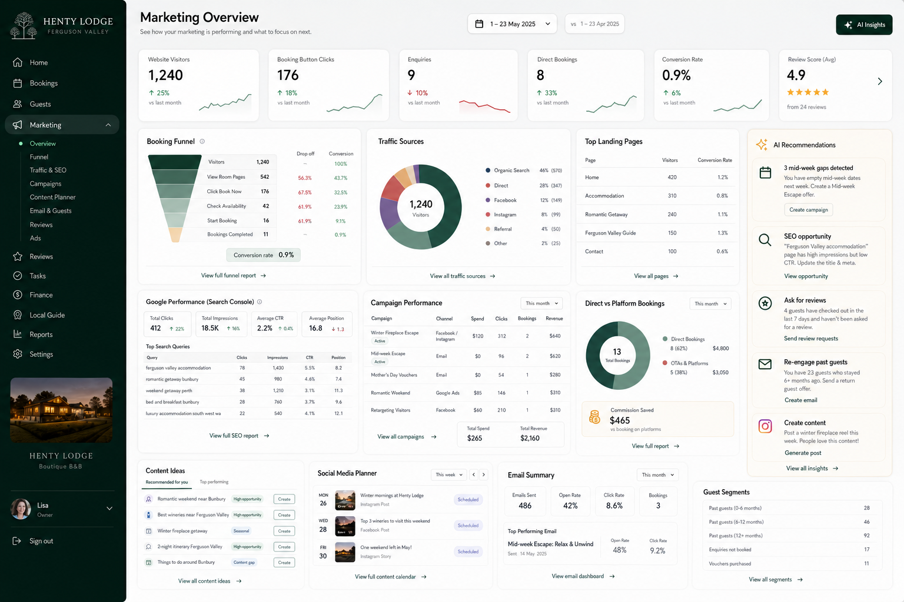
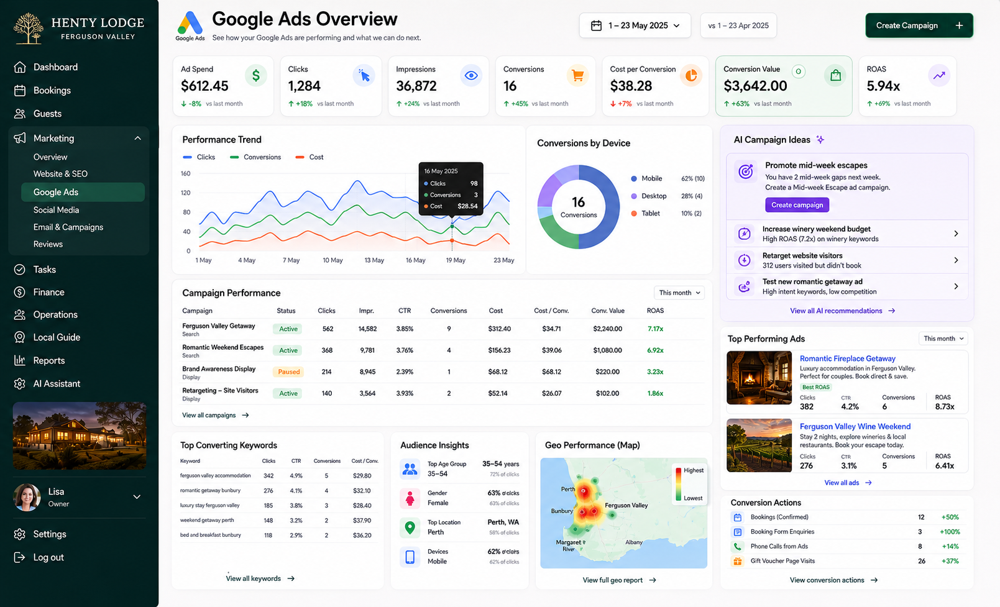
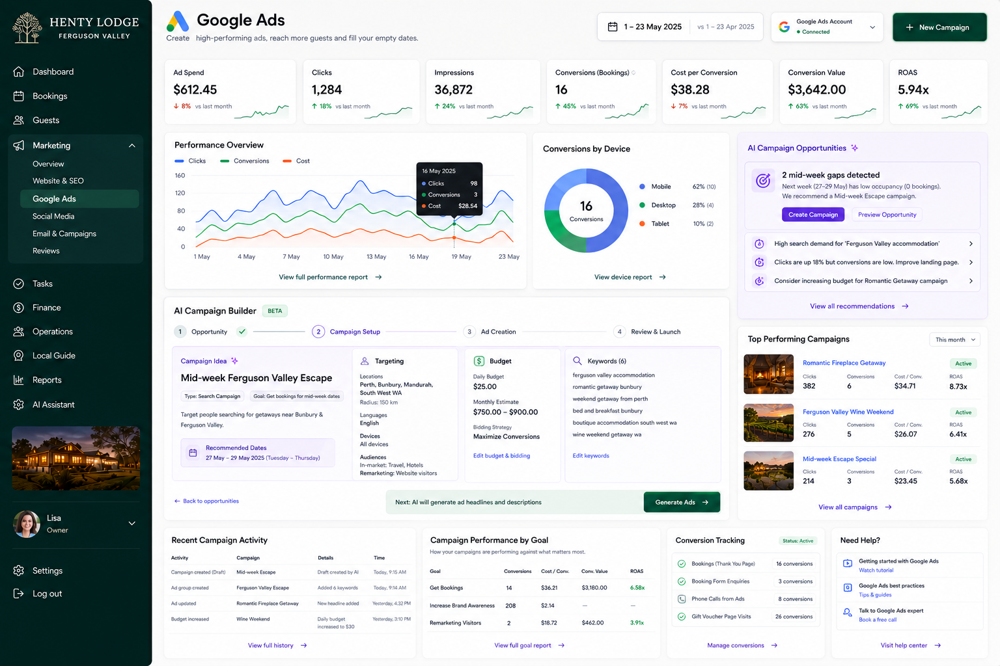

# UI Mockups

This project includes the mockup images used as the design reference for the MVP.

---

## 1. Main dashboard and sub dashboards

This is the primary MVP target.

Use this as the foundation for:

- Main layout
- Sidebar
- KPI cards
- Booking summary
- Occupancy calendar
- Task list
- Review requests
- Marketing overview
- AI suggestion card
- Preview of sub dashboards


---

## 2. Marketing dashboard

Use this as the longer-term reference for the Marketing & AI page.

It includes:

- Marketing overview metrics
- Booking funnel
- Traffic sources
- Search Console section
- Campaign performance
- Direct vs platform bookings
- AI recommendations
- Content ideas
- Social planner
- Email summary
- Guest segments



---

## 3. Google Ads overview

Use this as the future reference for paid ads reporting.

It includes:

- Ad spend
- Clicks
- Impressions
- Conversions
- Cost per conversion
- Conversion value
- ROAS
- Campaign performance
- Keywords
- Audience insights
- Geo performance
- AI campaign ideas



---

## 4. AI Google Ads builder

Use this as the future reference for AI-assisted campaign creation.

Important product rule:

> AI drafts campaigns. The user approves before campaigns are launched or budgets are changed.



---

## Asset paths

```txt
assets/mockups/main-dashboard-and-subdashboards.png
assets/mockups/marketing-dashboard.png
assets/mockups/google-ads-overview.png
assets/mockups/ai-google-ads-builder.png
```
